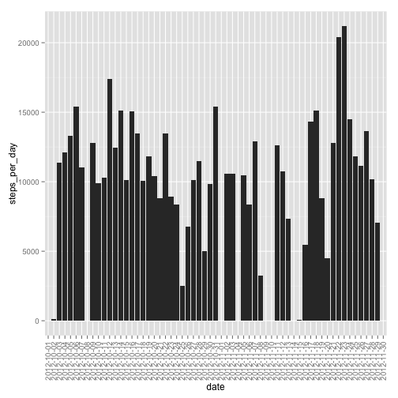
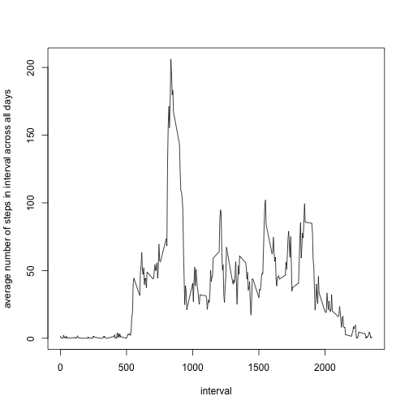

## Loading and preprocessing the data
### Loading the data file

```r
RR_week2 <- read.csv("~/Documents/Bioinformatics : Data analysis/Coursera/Data Science Specialisation/Reproducible Research/Week 2/activity.csv", na.strings=c("NA"))
```

### Preprocessing the data file

```r
# check if variables are in correct format
str(RR_week2)
```

```
## 'data.frame':	17568 obs. of  3 variables:
##  $ steps   : int  NA NA NA NA NA NA NA NA NA NA ...
##  $ date    : Factor w/ 61 levels "2012-10-01","2012-10-02",..: 1 1 1 1 1 1 1 1 1 1 ...
##  $ interval: int  0 5 10 15 20 25 30 35 40 45 ...
```

```r
# make steps numeric
steps <- as.numeric(RR_week2$steps, na.rm = TRUE)
RR_week2$steps <- steps 
```

## What is mean total number of steps taken per day?

### Calculate the total number of steps taken per day

```r
# load dplyr
library(dplyr)

# calculate the total number of steps per day
total_per_day <- RR_week2 %>%
  group_by(date) %>%
  summarise(steps_per_day = sum(steps))
```

### Create a histogramm of the total number of steps taken per day


```r
# plot a histogram with the total number of steps per day
library("ggplot2")
ggplot(total_per_day, aes(x=date, y=steps_per_day)) + geom_histogram(stat="identity") + theme(axis.text.x = element_text(angle = 90, vjust = 0.5, hjust=1))
```

```
## Warning: Removed 8 rows containing missing values (position_stack).
```

 

### Calculate and report the mean and median of the total number of steps taken per day 


```r
# calculate the mean number of total steps per day
#mean_per_day <- RR_week2 %>%
#  group_by(date) %>%
#  summarise(steps_per_day = mean(steps))
#mean_per_day

#median_per_day <- RR_week2 %>%
#  group_by(date) %>%
#  summarise(steps_per_day = median(steps))
#median_per_day

mean_total_steps_across_all_days <- mean(total_per_day$steps, na.rm=TRUE)
mean_total_steps_across_all_days
```

```
## [1] 10766.19
```

```r
median_total_steps_across_all_days <- median(total_per_day$steps, na.rm=TRUE)
median_total_steps_across_all_days
```

```
## [1] 10765
```

## What is the average daily activity pattern?

### Make a time series plot (i.e. type = "l") of the 5-minute interval (x-axis) and the average number of steps taken, averaged across all days (y-axis)


```r
# calculate the average number of steps taken across the 5-minute intervals averaged across all days 
daily_activity <- RR_week2 %>%
  group_by(interval) %>%
  summarise(ave_steps_across_daily_intervals = mean(steps, na.rm=TRUE))

# plot a time series with the average number of steps (y-axis) per 5-minute interval (x-axis) 
plot(daily_activity$interval, daily_activity$ave_steps_across_daily_intervals, type ="l", xlab="interval", ylab="average number of steps in interval across all days")
```

 

```r
# determine the 5 min interval that across all days contains the maximum number of steps
max(daily_activity$ave_steps_across_daily_intervals)
```

```
## [1] 206.1698
```

## Imputing missing values

### Calculate and report the total number of missing values in the dataset (i.e. the total number of rows with NAs)


```r
# identify the number of NA, is.na gives TRUE and FALSE, true is 1 false is 0, sum up
sum(is.na(RR_week2))
```

```
## [1] 2304
```

```r
# sum(is.na(RR_week2$steps)) gives identical result
```

### Devise a strategy for filling in for missing values in the dataset 

```r
# calculate means for that day for the dataset
mean_per_day <- RR_week2 %>%
  group_by(date) %>%
  summarise(steps_per_day = mean(steps, na.rm=TRUE))

# replace NaN's (or na) with 0's in dataframe, both mean and median will be 0 for these days...
mean_per_day[is.na(mean_per_day)] <- 0

# repeat mean as many times as datapoints for each day, which is 288
daily_mean <- rep(mean_per_day$steps_per_day,each=288)
```

### Create a new dataset with the missing data filled in

```r
# rename data frame
RR_week_daily_mean_repl_NA <- RR_week2
# add column daily mean to dataframe
RR_week_daily_mean_repl_NA$mean_of_the_day <- daily_mean
# extract info about the steps that are NA
stepsNA <- is.na(RR_week_daily_mean_repl_NA$steps)
# replace steps that are NA by daily mean
RR_week_daily_mean_repl_NA$steps[stepsNA] <- RR_week_daily_mean_repl_NA$mean_of_the_day[stepsNA]

# check that all na's are replaced in the new document
sum(is.na(RR_week_daily_mean_repl_NA))
```

```
## [1] 0
```

### Make a histogram of the total number of steps taken each day. Calculate and report the mean and median total number of steps taken per day. Do these values differ from the estimates from the first part of the assignment? What is the impact of imputing missing data on the estimates of the total daily number of steps?


```r
# calculate the total number of steps per day
total_per_day_NA_to_dmean <- RR_week_daily_mean_repl_NA %>%
  group_by(date) %>%
  summarise(steps_per_day = sum(steps))

# plot a histogram with the total number of steps per day
library("ggplot2")
ggplot(total_per_day_NA_to_dmean, aes(x=date, y=steps_per_day)) + geom_histogram(stat="identity") + theme(axis.text.x = element_text(angle = 90, vjust = 0.5, hjust=1))
```

 

```r
# calculate the mean and median number of total steps per day
mean_total_steps_across_all_days_2 <- mean(total_per_day_NA_to_dmean$steps)
mean_total_steps_across_all_days_2
```

```
## [1] 9354.23
```

```r
median_total_steps_across_all_days_2 <- median(total_per_day_NA_to_dmean$steps)
median_total_steps_across_all_days_2
```

```
## [1] 10395
```
###### The mean and the median are somewhat reduced, with the mean showing a stronger change (as there are more datapoints? less impact of outliers?)


## Are there differences in activity patterns between weekdays and weekends?


```r
# not completed
```
